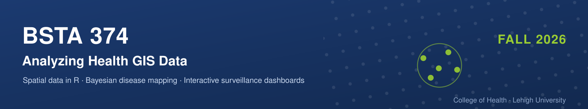

**Session type:** [In Person]{.in-person} \| [Demo + Studio]{.demo} \| [Studio]{.studio} \| [Presentations]{.presentation} \| [No Class]{.no-class}

**Tuesdays & Thursdays, 12:10--13:25 \| Rauch Business Center 137**

Where a disease occurs carries information that aggregate statistics discard. This course teaches you to map spatial health data honestly, to test whether a pattern differs from randomness, to model risk with its uncertainty, and to monitor that risk prospectively --- ending in a deployed surveillance dashboard you build and defend.

**Represent → Detect → Model → Monitor → Communicate**

Primary text: [Moraga, *Geospatial Health Data*](https://www.paulamoraga.com/book-geospatial/) (free online). Supplementary: Rogerson & Yamada, *Statistical Detection and Surveillance of Geographic Clusters* (R&Y, posted to Course Site).

There are **no quizzes and no exams**. Bring a laptop to every session.

## LECTURES

### [August 25]{.in-person} Introduction to Health GIS

-   Introduction to the syllabus; overview of course structure
-   Introduction of each other
-   Expectations re: exercises, the studio, and the final dashboard
-   Disease mapping, clustering, and correlation studies
-   Point data vs. aggregated areal data
-   Read Moraga Chapter 1

### [August 27]{.in-person} R Review

-   RStudio projects, paths, and why we never use `setwd()`
-   Vectors, data frames, tibbles; reading and writing CSV files
-   `dplyr`: filter, mutate, group_by, summarise, joins
-   The grammar of `ggplot2`: data, aesthetics, geoms, facets
-   Writing a small function; installing packages; reading an error message
-   Your first map with `geom_sf()`
-   In-class exercise: a short self-check --- if any of it is unfamiliar, come see me this week
-   Software setup: R, RStudio
-   [GITHUB Link](https://spatialepilehigh.github.io/rReview/)

### [September 1]{.in-person} Spatial Data in R

-   Three kinds of spatial data: areal (lattice), geostatistical, and point patterns
-   Simple features and the `sf` package; shapefiles and their component files
-   Geographic vs. projected CRS; `proj4` strings and EPSG codes
-   Introduction to Exercise 1

### [September 3]{.in-person} Thematic Cartography

-   Static and interactive maps: `ggplot2`, `tmap`, `leaflet`, `mapview`
-   Class intervals, color scales, and what they hide
-   Worked example: SID74 sudden infant deaths, North Carolina
-   In-class exercise: mapping the same rates four ways
-   Read Moraga Chapter 2

### [September 8]{.in-person} Version Control with Git & GitHub

-   Repositories, commits, branches, remotes
-   Why your future self needs this
-   In-class exercise: create and push your course repository

### [September 10]{.in-person} Reproducible Reporting

-   R Markdown: YAML, chunks and their options, figures, `knitr::kable()` tables
-   Moving the same document to Quarto
-   Publishing to GitHub Pages
-   Read Moraga Chapter 11 *(R Markdown only --- Quarto and GitHub Pages come from posted notes)*
-   Introduction to Exercise 2

### [September 15]{.in-person} Point Patterns

-   Complete spatial randomness as a null model
-   Quadrat analysis and the variance-mean ratio
-   Nearest-neighbor statistics
-   Ripley's *K* function; kernel density estimation and bandwidth choice
-   Read posted notes; R&Y Chapter 2

### [September 17]{.in-person} Point Patterns in Space--Time

-   The space-time *K* function; space-time interaction
-   Volume rendering of space-time case data
-   Positional and temporal uncertainty, and how it propagates
-   Read Delmelle et al. (2014)
-   In-class exercise: KDE of case locations, varying the bandwidth
-   Introduction to Exercise 3 *(worked on over Weeks 4--5)*

### [September 22]{.in-person} Aggregated Data and Incidence Rates

-   From cases to counts: aggregating points into areas
-   Incidence, prevalence, and mortality rates; person-time denominators
-   Crude rates; direct and indirect standardization
-   Expected counts from population strata; the SIR/SMR
-   Read Moraga 5.2

### [September 24]{.in-person} What Goes Wrong with Areal Data

-   Rate instability and the small-numbers problem
-   Why the extreme values on a raw SIR map are usually the small areas
-   MAUP: scale and zoning effects
-   The misaligned data problem; the ecological fallacy
-   In-class exercise: map raw SIRs, then map their population size --- compare
-   Read Moraga 5.5

### [September 29]{.in-person} Spatial Weights and Moran's I

-   Defining neighbors: contiguity (rook, queen), distance bands, *k* nearest
-   Row-standardized weights and why the choice matters
-   Moran's I: definition, expectation under the null, interpretation
-   Inference by permutation vs. the normal approximation
-   Read Moraga 5.1; R&Y Chapter 3

### [October 1]{.in-person} Reading and Using Global Statistics

-   The Moran scatterplot and its four quadrants
-   Join-count statistics for binary outcomes; Geary's C
-   What a significant Moran's I does *not* tell you
-   In-class exercise: building and reading a Moran scatterplot
-   *Preview: what if we recompute Moran's I every month? --- see November 24*
-   Introduction to Exercise 4

### [October 6]{.in-person} Local Spatial Statistics

-   From global to local: decomposing Moran's I
-   Local indicators of spatial association (LISA)
-   Cluster types: high-high, low-low, and the spatial outliers
-   Read R&Y Chapter 4

### [October 8]{.in-person} Hotspots and Multiple Testing

-   Getis-Ord Gi\* and hotspot mapping
-   Multiple testing and false discovery rate
-   Reading a LISA cluster map honestly
-   In-class exercise: building a LISA cluster map
-   Introduction to Exercise 5

### [October 13]{.in-person} Cluster Detection

-   The Kulldorff spatial scan statistic
-   Likelihood ratios, scanning windows, and Monte Carlo inference
-   Read R&Y Chapter 5

### [October 15]{.in-person} SaTScan in Practice

-   Spatial, temporal, and space-time scans
-   Poisson vs. Bernoulli models; choosing the maximum window
-   In-class exercise: running and interpreting a space-time scan
-   Introduction to Exercise 6

### [October 20]{.in-person} Bayesian Inference

-   Likelihood, priors, hyperpriors, posteriors
-   Hierarchical models and shrinkage; why smoothing helps with small numbers
-   MCMC and why we are not using it: cost and convergence
-   Read Moraga 3.1

### [October 22]{.in-person} INLA and the R-INLA Package

-   Latent Gaussian models; what INLA approximates and why it is fast
-   `inla()`: formula, `f()` random effects, `family`, `control.compute` (DIC, WAIC)
-   Priors, including penalized complexity (PC) priors
-   Worked example: mortality across 12 hospitals --- posterior summaries, credible intervals, and exceedance probabilities
-   Read Moraga 3.2 and Chapter 4
-   Studio rubric and dataset proposal instructions distributed

### [October 27]{.in-person} Bayesian Disease Mapping

-   Poisson model for counts; the BYM model and the CAR/ICAR prior
-   BYM2: interpretable precision and mixing parameters, PC priors
-   Case study: lip cancer in Scottish males, 1975--1980 (`SpatialEpi`, `poly2nb()`, `nb2INLA()`)
-   Mapping relative risks *and* exceedance probabilities
-   Read Moraga 5.3 and Chapter 6

### [October 29]{.in-person} Spatio-temporal Disease Mapping

-   Bernardinelli parametric trend: area-specific time slopes
-   Non-parametric alternatives (RW1, RW2); the four space-time interaction types
-   Case study: lung cancer in Ohio, 1968--1988; animated maps with `gganimate` and `plotly`
-   *This is the same Ohio dataset the Chapter 15 upload app displays --- the model you fit here is the one your dashboard shows*
-   Read Moraga 5.4 and Chapter 7
-   Introduction to Exercise 8

## THE STUDIO

Weeks 11--15 are a studio. Each Tuesday opens with a short demonstration; Thursdays are working time. You drive your own build, use the documentation, and bring specific problems to class. Milestones are demonstrated **live in class** --- a milestone is a working increment of your app, not a write-up about it.

### [November 3]{.demo} Demo: from R Markdown to `flexdashboard`

-   Column layout, `###` panels, `data-width`
-   Embedding `leaflet` maps, `DT` tables, `ggplot2` charts
-   Worked example: global PM~2.5~ air pollution
-   Read Moraga Chapter 12

### [November 5]{.studio} Studio --- M1: static dashboard

-   Working studio time. Bring specific problems.
-   **M1 demonstrated in class:** a `flexdashboard` that loads your data and displays at least one map and one time series

### [November 10]{.demo} Demo: Introduction to Shiny

-   `ui` / `server` structure; `shinyApp()`
-   Inputs (`selectInput`, `sliderInput`, `fileInput`) and `render*()` outputs
-   How reactivity actually flows --- and common mistakes
-   `runtime: shiny` in a dashboard YAML header
-   Read Moraga Chapters 13--14

### [November 12]{.studio} Studio --- M2: reactive app

-   Working studio time. Bring specific problems.
-   **M2 demonstrated in class:** the user selects a region and a time period, and the maps and summaries respond

### [November 17]{.demo} Demo: Uploading Spatio-temporal Data

-   Reading an uploaded CSV plus a full shapefile (`.shp`, `.dbf`, `.shx`, `.prj`)
-   `dygraphs` time series + `leaflet` choropleth, driven by variable and year dropdowns
-   Handling missing inputs --- where student apps break
-   Read Moraga Chapter 15 *(the closest thing to your project)*

### [November 19]{.studio} Studio --- M3: spatio-temporal handling

-   Working studio time.
-   **M3 demonstrated in class:** the app steps through spatio-temporal data and displays modeled rates with their uncertainty

### [November 24]{.demo} Prospective Surveillance --- M4: monitoring panel

-   Retrospective analysis vs. *prospective* monitoring: why repeated testing changes the problem
-   Statistical process control and the CUSUM chart: the cumulative sum, the reference value *k*, the decision interval *h*, average run length
-   Monitoring Moran's I or an SMR over time *(as previewed on October 1)*
-   Other routes: exceedance probabilities, space-time scans on recent periods, period-over-period comparison
-   Flagging rules: thresholds, false alarms, and detection speed
-   SpatialEpiApp: R-INLA risk estimates and SaTScan clusters behind a point-and-click interface --- the reference implementation
-   Deployment and documentation
-   *CUSUM is covered properly here; using it in your app is optional --- M4 accepts any defensible monitoring display*
-   Read R&Y Chapters 7--8; Moraga Chapter 16
-   **M4 demonstrated in class**

### [November 26]{.no-class} Thanksgiving Recess --- No Class

### [December 1, 3]{.presentation} Final Dashboard Presentations

-   Ten-minute live demonstration of your dashboard --- drive the app, do not present slides
-   Introduce the data and the health question in under two minutes
-   Show the monitoring panel doing something: a flag raised, or correctly not raised, and why that is the right behavior at your threshold
-   State one thing you would fix or add with another two weeks
-   Expect to be asked how any part of it works
-   Course wrap-up and reflections on December 3

### [No Final Exam]{.no-class} Assessment is complete at the end of Week 15

------------------------------------------------------------------------

\| **last updated August 26 2026** \| [erd424\@lehigh.edu](mailto:erd424@lehigh.edu)

```{=html}
<!-- Topic schedule only. Exercise deadlines, milestone points, the dataset
     proposal, grading and course policies live in the syllabus, so that this
     page stays reusable from year to year.

     Lecture links follow the pattern https://spatialepilehigh.github.io/<repo>/
     Add each one to the session block as the repo is published:
       Sep 1   spatialDataInR
       Sep 3   thematicCartography
       Sep 8   gitAndGitHub
       Sep 10  reproducibleReporting
       Sep 15  pointPatterns
       Sep 17  pointPatternsSpaceTime
       Sep 22  aggregatedDataRates
       Sep 24  arealDataProblems
       Sep 29  spatialWeightsMoran
       Oct 1   globalStatistics
       Oct 6   localStatistics
       Oct 8   hotspotsMultipleTesting
       Oct 13  clusterDetection
       Oct 15  satscanInPractice
       Oct 20  bayesianInference
       Oct 22  inlaAndRINLA
       Oct 27  bayesianDiseaseMapping
       Oct 29  spatioTemporalMapping
       Nov 3   flexdashboardDemo
       Nov 10  shinyDemo
       Nov 17  uploadSpatioTemporal
       Nov 24  prospectiveSurveillance
-->
```
